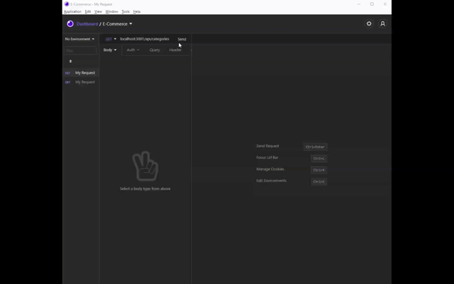
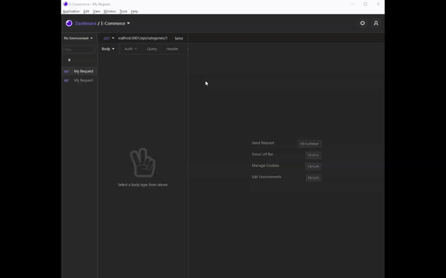

# E-Commerce Back End

The task for this assignment is to build the back-end for an e-commerce site by modifying starter code. This assingment uses Express.js, Sequelize, and MySQL to allow a user to view, update, and delete data from the database on the back-end. This assignment does not have a front-end.

## Mock-Up

The following animation shows the application's GET routes to return all categories, all products, and all tags being tested in Insomnia:

The following animation shows the application's GET routes to return a single category, a signle product, and a single tag being tested in in Insomia:

The following animation shows the application's POST, PUT, and DELETE routes for categories being tested in Insomnia:

